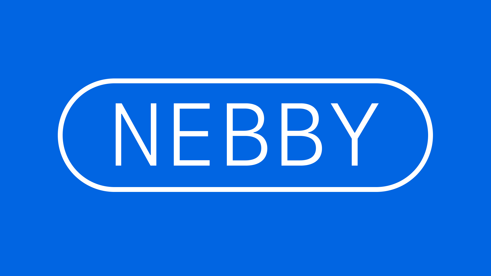
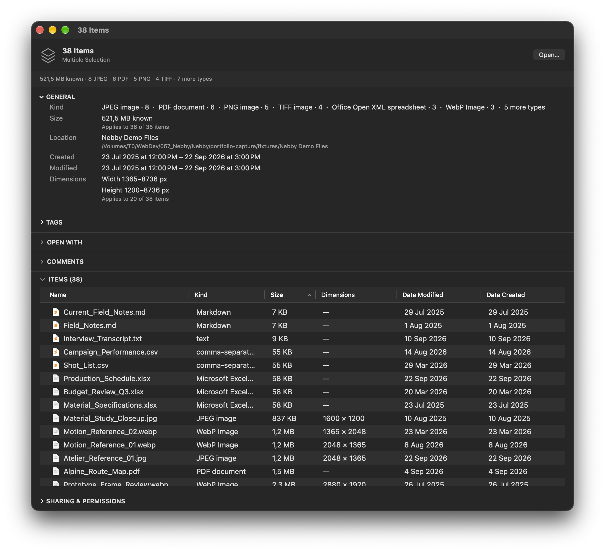

# Nebby

**A selection-aware Get Info for macOS.**



Finder understands individual files very well. It becomes considerably less coherent when several files are selected: `⌘I` opens one Get Info window per item, while Summary Info and Finder’s Inspector reduce the collection to only part of what is known about it.

Nebby starts from a different premise:

> **The selection is itself an object.**

Instead of multiplying windows or flattening a selection into a few totals, Nebby keeps the collection intact while exposing what its members share, where they differ, and what can meaningfully be understood about them together.



## One selection, one information surface

Nebby opens as a compact inspector for the complete selection.

Its **General** section describes the collection: item types, known size, location, dates, dimensions and other properties that can be shared, mixed or aggregated.

Expanding **Items** reveals the files behind that summary in a native macOS table. The window grows with the interaction rather than switching to another view.

The table behaves like a Mac table should: native file icons, sortable columns, multiple selection, keyboard behaviour and a configurable column set.

<!-- Expanded Items screenshot -->

Selecting rows does not replace the original selection. It creates a narrower **inspection scope** inside it.

A single selected row shows that file’s information. Selecting several rows recomputes the same inspector for that subset. **All N Items** returns to the complete parent selection without rebuilding the context.

<!-- Single-item and subset screenshots -->

## Information without flattening

Multi-selection creates several different kinds of information, and Nebby keeps them distinct.

A property can be:

- **shared** — every item has the same value;
- **mixed** — the property applies to the selection, but values differ;
- **aggregate** — individual values can be meaningfully combined or ranged;
- **partially applicable** — the property only makes sense for some items;
- **unavailable** — the property should exist, but could not be read.

Those distinctions matter.

A folder does not have “unknown image dimensions”; dimensions simply do not apply to it. A corrupt image is different: dimensions do apply, but could not be read. Treating both cases as `N/A` would discard useful information.

The same model applies to editable properties. A tag can exist on all items, some items or none, represented through native checked, indeterminate and unchecked states.

<!-- Mixed tags screenshot -->

## Scope-aware changes

Edits apply to the current inspection scope.

There is no secondary “Apply to all” concept because the target has already been established by the interaction: all parent items, one item, or the currently inspected subset.

When an operation only partly succeeds, Nebby does not turn the result into an all-or-nothing failure.

> **Successful changes persist.**

The unresolved items remain visible with their individual failure reasons. Retry operates only on those failures; successful work is not repeated or rolled back.

<!-- Partial failure screenshot -->

## Design principles

1. **One selection, one information surface.**
2. **Shared, mixed and aggregate values retain different meanings.**
3. **Inspect a member or subset without losing the parent context.**
4. **The current scope determines the target of an edit.**
5. **Partial failure does not erase successful work.**
6. **Native macOS behaviour takes precedence over imitating a mock-up.**

## Native implementation

Nebby is a native macOS application built in Swift.

The domain model is deliberately separate from the interface:

- `FileItem` represents immutable metadata for one filesystem object.
- `ParentSelection` owns the files supplied to Nebby.
- `InspectionScope` identifies the subset currently being examined.
- `FileMetadataReader` reads filesystem metadata through Foundation and ImageIO.
- `SelectionAggregator` derives shared, mixed, aggregate and partial values from any inspection scope.
- `AggregateSelection` carries those semantics without presentation strings leaking into the model.

SwiftUI provides the inspector and disclosure structure. AppKit is used where native desktop behaviour matters: the Items view is backed by `NSTableView`, giving Nebby standard macOS row selection, keyboard interaction, sorting and column behaviour rather than recreating them in a custom control.

Native file icons come from `NSWorkspace`. File input uses `NSOpenPanel` and Finder drag-and-drop.

## Build

Nebby currently targets **macOS 27.0** and was built with **Xcode 27.0**.

```sh
git clone https://github.com/scapintobias/nebby.git
cd nebby
open Nebby.xcodeproj
```

Build the Debug app:

```sh
DEVELOPER_DIR=/Applications/Xcode.app/Contents/Developer xcodebuild \
  -project Nebby.xcodeproj \
  -scheme Nebby \
  -configuration Debug \
  -destination 'platform=macOS' \
  -derivedDataPath /tmp/NebbyDebugDerivedData \
  CODE_SIGNING_ALLOWED=NO \
  build
```

Run the test suite:

```sh
DEVELOPER_DIR=/Applications/Xcode.app/Contents/Developer xcodebuild \
  -project Nebby.xcodeproj \
  -scheme Nebby \
  -configuration Debug \
  -destination 'platform=macOS' \
  -derivedDataPath /tmp/NebbyTestDerivedData \
  CODE_SIGNING_ALLOWED=NO \
  test
```

The test suite covers metadata extraction, folders, symbolic links, image dimensions, corrupt metadata, aggregate semantics, incomplete applicability, inspection scope, mixed state and partial-failure recovery.

## Local app

A local Release build can be produced with:

```sh
./Scripts/build-local-app.sh
```

The resulting application is written to:

```text
dist/Nebby.app
```

`LOCAL_APP.md` documents the local build and icon workflow.

This is currently a local build, not a signed and notarised public distribution package.

## Status

Nebby began as an interaction-design study and now exists as a functioning native macOS application.

It is deliberately not a Finder replacement. The current build accepts selections through Open and Finder drag-and-drop; direct replacement of Finder’s `⌘I` behaviour is not yet implemented.

The original question remains the entire project:

> **What is true of this selection?**

Nebby is an attempt to make macOS answer that question without opening forty windows.
